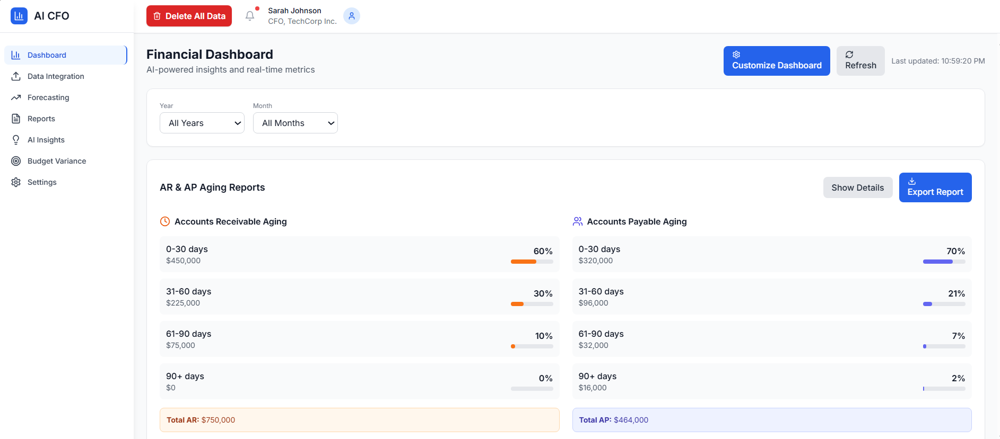
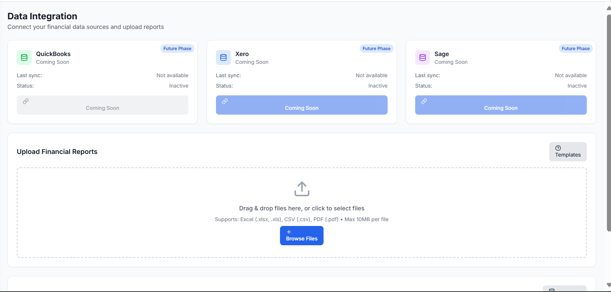
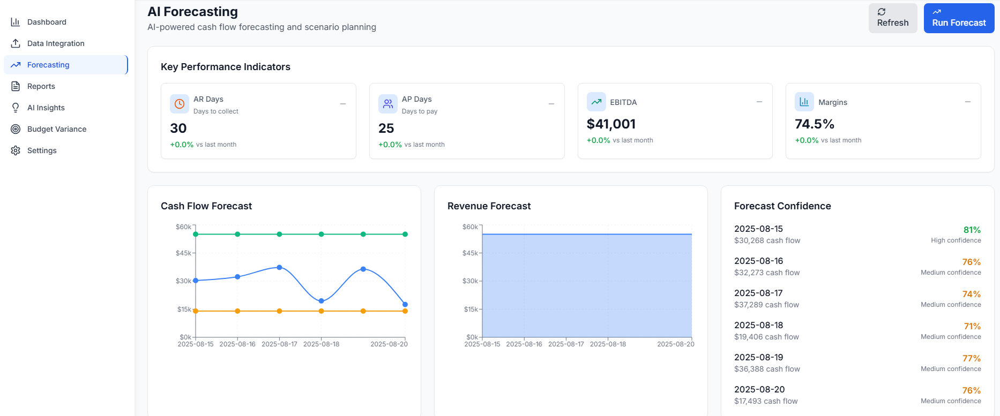
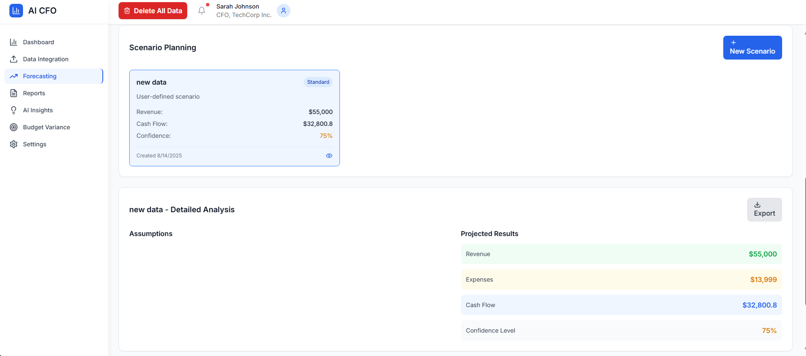
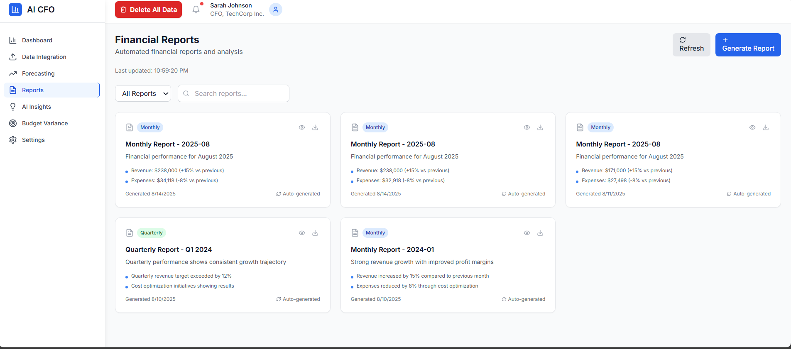

# AI CFO Assistant


A comprehensive AI-powered financial management platform designed for CFOs, finance managers, and business owners to make better financial decisions through real-time data insights, forecasting, and AI-driven recommendations.

## 📸 Screenshots


_Real-time financial dashboard with key metrics and interactive charts._


_Seamlessly connect to multiple data sources including QuickBooks, Xero, and file uploads._


_AI-powered cash flow forecasting and scenario modeling._


_Generate and export professional financial reports._


_Get real-time alerts and AI-driven insights to optimize costs and detect anomalies._

## 🚀 Features

- **Financial Data Integration**: Connect to QuickBooks, Xero, Sage, NetSuite, or upload Excel, CSV, and PDF files.
- **Real-Time Financial Dashboard**: Customizable dashboard with key metrics like revenue, expenses, profit/loss, and cash flow.
- **AI Forecasting & Scenario Planning**: "What-if" analysis and cash flow projections for 30, 60, or 90 days.
- **Automated Financial Reports**: Generate P&L statements, balance sheets, and cash flow reports with AI-powered executive summaries.
- **AI-Powered Insights & Alerts**: Real-time notifications for overspending, unusual transactions, and fraud detection.

## 🛠️ Technology Stack

**Frontend:**
- React 18 with TypeScript
- Tailwind CSS for styling
- Recharts for charts
- React Router for navigation
- Axios for API requests

**Backend:**
- Node.js with Express
- Gemini API for AI-powered insights
- SQLite3 for the database
- Multer for file uploads

## 📦 Installation & Setup

### Prerequisites
- Node.js (v18 or later)
- npm

### 1. Clone the Repository
```bash
git clone https://github.com/HAMZOO0/AI-Assistant-CFO
cd ai-cfo-assistant
```

### 2. Backend Setup
```bash
# Navigate to the backend directory
cd backend

# Install backend dependencies
npm install

# Create a .env file from the example
# (and update with your API keys)
cp config.env .env

# Initialize and seed the database
node database/init.js
node database/seed-reports-insights.js

# Start the backend server
npm start
```
The backend will be running on `http://localhost:5000`.

### 3. Frontend Setup
```bash
# Navigate to the root project directory
cd ..

# Install frontend dependencies
npm install

# Start the frontend development server
npm start
```
The frontend will be running on `http://localhost:3000`.

## 🏗️ Project Structure
```
/
├── backend/            # Node.js/Express backend
│   ├── database/       # SQLite database and scripts
│   ├── routes/         # API routes
│   └── services/       # Services (e.g., Gemini AI)
├── public/             # Public assets
├── src/                # React frontend source
│   ├── components/     # Reusable UI components
│   ├── context/        # React context providers
│   ├── pages/          # Application pages
│   ├── services/       # Frontend API services
│   └── types/          # TypeScript types
├── pic/                # Screenshots and images
└── ...
```

## 🔮 Future Enhancements

- **Industry Benchmarking**: Compare financial performance against industry peers.
- **Advanced AI Models**: Train custom machine learning models for more accurate predictions.
- **Mobile App**: Develop a React Native mobile application.
- **Team Collaboration**: Introduce features for team collaboration and report sharing.

## 🤝 Contributing

Contributions are welcome! Please follow these steps:
1. Fork the repository at https://github.com/HAMZOO0/AI-Assistant-CFO
2. Create a new feature branch (`git checkout -b feature/your-feature`).
3. Commit your changes (`git commit -m 'Add some feature'`).
4. Push to the branch (`git push origin feature/your-feature`).
5. Open a pull request.

